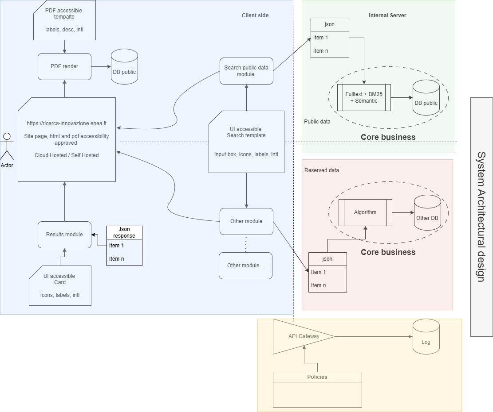

# Documentazione Web Components "innovazione"

Questa libreria esporta diversi Web Components basati su React, registrati tramite `react-to-webcomponent`.

## 1. innovazione-search (`SearchBasic.tsx`)

Questo componente fornisce l'interfaccia di ricerca principale, includendo la barra di ricerca, il tasto per i filtri e l'integrazione con il componente dei filtri.

### Parametri di Inizializzazione (Props)

| Attributo | Tipo     | Descrizione                                 |
| :-------- | :------- | :------------------------------------------ |
| `baseurl` | `string` | URL di base per le chiamate API di ricerca. |

_fissato su costante `BASE_URL`_ 2025-12-30

### Funzionamento

- Inizializza lo stato caricando le categorie e i metadati da un endpoint pubblico (`summarizepublic`).
- Gestisce l'interfaccia della barra di ricerca (`SearchForm`).
- Include internamente il componente `<innovazione-filter>`.
- **Integrazione Filtri**: Ascolta l'evento `innovazione-filterEvent` per aggiornare lo stato dei filtri selezionati.
- **Logica di Ricerca**: Effettua ricerche testuali tramite l'endpoint `basicsearch`.
- **Applicazione Filtri**: Quando l'utente preme "Applica Filtri", il componente filtra localmente i record caricati all'avvio e notifica i risultati tramite `innovazione-searchEvent`.
- **Reset**: Pulisce i risultati quando il pannello dei filtri viene chiuso o tramite il tasto di reset.

---

## 2. innovazione-filter (`Filters.tsx`)

Questo componente visualizza i cluster di filtri (Applicazioni, Tecnologie, Licenze) e uno slider per il TRL.

### Parametri di Inizializzazione (Props)

| Attributo      | Tipo            | Descrizione                                                            |
| :------------- | :-------------- | :--------------------------------------------------------------------- |
| `applications` | `string` (JSON) | Array di oggetti `{ cls: string }` per i filtri applicativi.           |
| `technologies` | `string` (JSON) | Array di oggetti `{ cls: string }` per le tecnologie/offerte tecniche. |
| `licenses`     | `string` (JSON) | Array di oggetti `{ cls: string }` per le licenze.                     |
| `trl`          | `string` (JSON) | Oggetto `{ min: number, max: number }` per i limiti dello slider TRL.  |
| `showfilter`   | `boolean`       | Determina se il pannello dei filtri è visibile o compresso.            |

### Interfaccia di Comunicazione (Eventi)

- **Emette**: `innovazione-filterEvent` (su `window`)
  - **Dettaglio (`detail`)**: `FilterEventInterface`
    ```typescript
    {
      appselected: string[];
      licselected: string[];
      otselected: string[];
      minmax: { min: number, max: number };
    }
    ```
  - Viene scatenato ogni volta che un filtro viene selezionato o deselezionato.

---

## 3. innovazione-results (`Results.tsx`)

Questo componente visualizza l'elenco dei risultati della ricerca in formato grid.

### Parametri di Inizializzazione (Props)

| Attributo | Tipo     | Descrizione                                |
| :-------- | :------- | :----------------------------------------- |
| `baseurl` | `string` | URL di base per eventuali risorse esterne. |

### Interfaccia di Comunicazione (Eventi)

- **Ascolta**: `innovazione-searchEvent` (su `window`)
  - Riceve i dati della ricerca per aggiornare la visualizzazione locale dei risultati.
- **Emette**: `innovazione-resultsEvent`
  - Scatenato al refresh dei risultati o quando viene selezionato un documento.

---

## 4. innovazione-pdf-button (`DownloadPDFButton.tsx`)

Questo componente renderizza un pulsante per il download del PDF di una scheda specifica.

### Parametri di Inizializzazione (Props)

| Attributo | Tipo     | Descrizione                                      |
| :-------- | :------- | :----------------------------------------------- |
| `id`      | `string` | Identificativo univoco della scheda da scaricare |

---

## Interfacce Eventi (`ComponentEvents.ts`)

Tutti i componenti comunicano tramite standard DOM Events scatenati sull'oggetto `window` o tramite bubbling.

### SearchEventInterface

Inviato da `innovazione-search` verso `innovazione-results`.

```typescript
{
  records: {
    total: number;
    start: number;
  };
  query: string;
  found: SearchResult[]; // Lista dei risultati pronti per la visualizzazione
}
```

### FilterEventInterface

Inviato da `innovazione-filter` verso `innovazione-search`.

```typescript
{
  appselected: string[];
  licselected: string[];
  otselected: string[];
  minmax: {
    min: number;
    max: number;
  };
}
```

### Riassunto Eventi di Sistema

| Nome Evento                | Classe Evento  | Descrizione                                                 |
| :------------------------- | :------------- | :---------------------------------------------------------- |
| `innovazione-filterEvent`  | `FilterEvent`  | Notifica i cambiamenti nei filtri selezionati.              |
| `innovazione-searchEvent`  | `SearchEvent`  | Notifica l'arrivo di nuovi risultati di ricerca o filtrati. |
| `innovazione-resultsEvent` | `ResultsEvent` | Notifica interazioni o aggiornamenti nell'elenco risultati. |

**schema di design**


